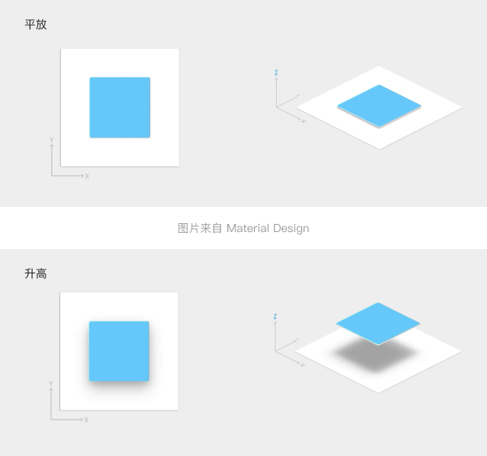
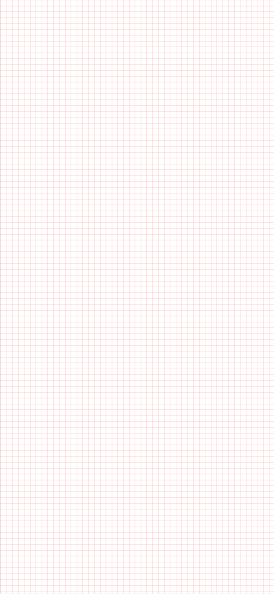
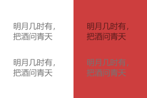

# 胡子 UI

「胡子 UI」是一套 React UI 库，同时也是一套设计理念，旨在帮助更多开发者不再为了设计而困扰。

## 1 设计原则

### 一致

同级元素和结构需保持一致；同样功能的元素需要保持一致。

比如：文本大小、文本颜色、图标、元素的位置间隔等。

### 确定

设计应该是确定的、直观的，不应该让用户产生疑惑或藏有太多暗示隐喻。

语言表达清晰且表意明确，可以让用户快速理解进而作出决策。

### 自然

随着科技的发展，用户界面也随着日益复杂，但人类注意力是有限的——这是一种矛盾。

面对这种设计矛盾，追求「自然」的交互是对用户更友好，并且能极大降低用户学习成本的一件事。

例如色彩、阴影、图标、动画、操作手势等等，应充分汲取自然界的客观规律，从而降低用户的认知成本，为其带来更真实更流畅的感受。

### 意义

产品中的每一处设计都需要有其意义，不可为了追求设计感而去设计。

例如动画效果（以下简称动效），动效可以有效地指引、暗示用户，所以动效的设计要根据用户行为而定，并且符合真实物体的运动规律。

动效的存在应该是有意义的、合理的，目的是为了吸引用户的注意力，以及维持整个系统的连续性体验。

### 反馈

用户需要清楚的知道自己的操作结果。

我们可以通过界面样式和交互动效让用户可以清晰的感知自己的操作。并且在操作过后，应该通过页面元素的变化清晰地展现当前的状态。

---

## 2 光影

光影通常在游戏中占据重要的地位，是评判游戏画面是否真实的最重要的标准之一。

因为真实世界中的物体处于不同的位置时会投射出不同的阴影、反射出效果不同的光线；相同高度物体之间可以相互拼接；不同高度的物体可以相互叠加。

这些都是符合自然界的客观规律的。

在 UI 的设计中也需要在一定程度上遵循自然界的物理特性。

首先假想出一个白色的平面、一束垂直打向平面的光与一个高度为“单位 1”的任意物体。那我们能得出以下结论：

1. 当物体放置于平面上时无阴影；
2. 当物体升高后阴影出现；
3. 物体进一步升高，阴影则会变得更散、范围更大；
4. 同理，物体降低后，阴影变实、范围变小。



如果两个物体在光影的表现上明显高度不同，但看起来比较矮的物体居然叠加在了高物体的上方——这就让人产生了不真实、不符合逻辑的感受。

**UI 设计非常需要逻辑**，并且需要尽可能的符合人们的认知。

因为 UI 设计中一旦出现了违背客观常识的阴影或者是违背阴影所体现的高度的组件重叠时，用户就会觉得十分怪异。

**我们需要通过阴影的变化构建出用户熟悉的空间模型。**

**平面的 UI 设计应该是“立体的”，阴影起到的作用便是启示用户组件的高度。**

推荐开发者使用五种高度来设计产品的界面： 平铺（无）、一般高度（低）、激活高度（中）、关联高度（高）、无关高度（最高）。

**平铺：** 平铺即为无高度且无阴影。

适合此高度的组件有：输入框（未激活） / 按钮（非浮动按钮） / 快速入口……等等。

// TODO：放图

**一般高度：** 一般高度拥有范围较小的阴影。

适合需要突出显示一些的组件，例如卡片 / 浮动按钮……等等。

// TODO：放图

**激活高度：** 激活高度，拥有比较显著阴影。

适合用作处于平铺或一般高度的物体被交互时的海拔提升，给予用户反馈。

适合此高度的组件有：输入框（激活） / 按钮（hover） / 卡片（hover）……等等。

// TODO：放图

**关联高度：** 关联高度，拥有较大范围的阴影。

顾名思义，一般用于“与页面组件有关系”的组件，例如下拉菜单。

适合此高度的组件有：下拉选框 / 弹出式菜单 / 弹出式日历组件……等等。

// TODO：放图

该高度的组件是会随着页面运动而运动的。

**无关高度：** 无关高度，拥有最大范围的阴影范围。

顾名思义，一般用于“与页面组件无关的组件”，例如警告弹框。 适合此高度的组件有：弹框 / Alert / Confirm……等等。

// TODO：放图

该高度的组件是不会随着页面运动而运动的。

---

## 3 页面布局与响应式页面

UI 界面的设计是和传统的平面设计截然不同的。

因为显示设备的繁多，导致很多种界面分辨率、比例的同时存在，我们必须要尽可能地让所有的用户正常体验正常浏览。

因此 UI 界面的布局必须要基于「动态」的角度展开设计。

### 3.1 布局

此处仅讨论网页主体部分的布局方案，不涉及网页的头与尾。

#### 方案一：一边不动一边动

这是常见的两栏布局：将一边栏固定，对另一侧进行动态缩放。通常会将固定的一栏作为导航栏，动态缩放的一侧作为工作区或主要显示区域。

// TODO：上图

当屏幕进一步缩小（例如 iPad）时，固定栏可进行适当缩小，省略文字或图标，为主要显示区域留足空间。

// TODO：上图

当屏幕再一次缩小（手机）时，左侧固定栏可变为底栏或顶栏，让主要显示区域占据所有空间，并跟随设备宽度的变化而变化。

// TODO：上图

#### 方案二：居中缩放有最大

此为单栏布局。显示区域居中放置并设置最大宽度，例如最大宽度设为 1200px：

1. 当应用或浏览器宽度大于 1200px 时，显示区域居中，并且无论宽度如何增大，显示区域宽度都不变；
2. 当应用或浏览器宽度小于 1200px 时，显示区域随着宽度的减少而对应的减少以适配新的宽度。

该种布局方案通常会在页面两侧留下安全距离。若安全距离为 30px，则当页面缩放至两侧均为 30px 时就会变化显示区域——不会让显示区域直接触碰页面的边缘。

#### 方案三：居中缩放无最大

该方案为“方案二：居中缩放”有最大的变式，即页面宽度不管如何变化，显示区域都会随着宽度的变化而变化（通常是保证两边的安全距离不变）。

不推荐使用该方案。因为该种适应性非常差，例如用户使用的是 21 : 9 的带鱼屏。

#### 方案四：融合方案一与二

为了适应更宽的屏幕，我们应该保证方案一的两栏总宽度是有上限的，即最大宽度。

如同方案二一般，当宽度缩处于一定的大小时，总宽度保持不变并且总体居中；当小于设定宽度后，再对总宽度进行缩放。

// TODO：上图

### 3.2 度量标准

简单来说，度量标准的就是单位长度。 通常来说宏观上推荐以 8px 为标准，细微的地方推荐以 4px 作为标准。

例如我们选取 8px 作为单位长度，那么我们在设计中，将会在画板上标注出 8px 为边长的方块作为辅助。



我们的所有物件的外框都需要贴合上这些「格子」，若非特殊情况，请不要切断这些格子。

这也就意味着，在一个应用中，物体间隔与物体大小应该符合 4 或 8 的倍数原则。 在宏观布局上采用 8 的倍数；在文字段落、组件内部等细微之处采用 4 的倍数。

或者我们可以不实用网格布局，而使用栅格布局。


规则上与网格布局类似。不多介绍。 总之，不论是网格还是栅格，都是为了强调「对齐」与「整体感」，如此以 n 为倍数的长度设计通常会比随心所欲的设计更有韵律感。

### 3.3 断点

根据谷歌规范的推荐，我们应该在 480、600、840、960、1280、1440、以及 1600px 设置断点。

- 可以认为 480px 以下是为了适配移动设备；480px - 1280px 是在适配平板；
- 1280px 以上都是桌面设备。

总而言之，不必太过死板于数值，断点设置的宽度，就是组件摆不下了的宽度，或是摆放不好看的宽度。

但是如此之多的断点让我们适配起来非常麻烦。所以十分推荐使用 3.1 中推荐的布局方案，可以最大程度的减少适配所需工作量。

注意：做断点适配时，不要忘记 3.1 提到的安全距离，推荐使用的安全距离有 8、16、24、或 40px。

## 4 文字

在一个页面中，字号字体字色的选择尽量保持在 3-5 种之间，请保持克制。

### 4.1 文字颜色

文字颜色或阴影颜色请使用带透明度的黑色或白色，而不是使用纯色黑白。

**例如：`rbga(0, 0, 0, 0.87)`**

上方两颜色均为 `rgba(0, 0, 0, 1)`

下方两颜色均为纯色 `rgb(0, 0, 0)`


上方两颜色均为 `rgba(0, 0, 0, 0.87)`

下方两颜色均为纯色 `rgb(33, 33, 33)`


上方两颜色均为 `rgba(0, 0, 0, 0.54)`

下方两颜色均为纯色 `rgb(117, 117, 117)`



可以看到，随着颜色的变浅，透明度的优势变得越来越大，纯色都变得几乎不可看了！

所以只要我们不使用纯黑 `#000000`，使用任何的灰色时，都应该尽量使用透明度系统。

带有透明度的颜色可以更好的适配多种不同的颜色背景，如果使用纯色就需要使用更多的颜色来适配不同颜色的背景。

| 黑色                | 白色                      | 重要程度                 |
| ------------------- | ------------------------- | ------------------------ |
| rgba(0, 0, 0, 1)    | rgba(255, 255, 255, 1)    | Important（标题）        |
| rgba(0, 0, 0, 0.87) | rgba(255, 255, 255, 1)    | Primary（重要文字）      |
| rgba(0, 0, 0, 0.72) | rgba(255, 255, 255, 0.87) | Secondary（大段文字）    |
| rgba(0, 0, 0, 0.54) | rgba(255, 255, 255, 0.7)  | Tertiary（不重要文字）   |
| rgba(0, 0, 0, 0.38) | rgba(255, 255, 255, 0.5)  | Commentary（注释或禁用） |
| rgba(0, 0, 0, 0.12) | rgba(255, 255, 255, 0.12) | Hint（分割线）           |
| rgba(0, 0, 0, 0.54) | rgba(255, 255, 255, 1)    | 图标（启用）             |
| rgba(0, 0, 0, 0.38) | rgba(255, 255, 255, 0.5)  | 图标（禁用）             |

## 4.2 字体与大小与排版

### 4.2.1 字体

字体若无特殊原因，应该尽量选择常见的黑体。

一方面易于用户识别，一方面不会因为用户的设备没有该字体而影响预期的显示效果。

首先以下字体的声明都非常的糟糕：

```css
 {
  font-family: "宋体";
  font-family: "宋体", Arial;
  font-family: Arial, "宋体", "微软雅黑";
  font-family: Helvetica, Arial, "华文细黑", "微软雅黑";
}
```

很多开发者忽略了这一点：尽管我们在操作系统中常常看到：“华文细黑”、“微软雅黑”、“宋体”……等等。

这样的字体名称只是字体的显示名称，而不是字体文件的名称。

例如在 Windows 系统中这种声明是有效的，但是在 MacOS 系统中就会导致你的字体声明无效。

所以请记住：

同时声明中文字体的英文和中文名称，并且英文应该在中文之前，就像这样：

```css
 {
  font-family: SimSun, "宋体";
  font-family: "Microsoft YaHei", "微软雅黑";
  font-family: STXihei, "华文细黑", "Microsoft YaHei", " 微软雅黑";
}
```

另外一点需要谨记的：**绝大部分中文字体里包含英文字母，但是基本上都很丑；而英文字体里绝大多数都不包含中文字符。**

所以我们需要先声明英文字体，后声明中文字体，例如：

```css
 {
  font-family: Georgia, SimSun, "宋体";
}
```

这样就保证英文字体不会使用宋体，而是使用 Georgia。

在最后，需要加上英文字体族的名称，衬线字体使用 serif，非衬线使用 sans-serif。

推荐使用「Fonts.css -- 跨平台中文字体解决方案」推荐的写法：

```css
 {
  /*黑体*/
  font-family: -apple-system, "Noto Sans", "Helvetica Neue", Helvetica,
    "Nimbus Sans L", Arial, "Liberation Sans", "PingFang SC",
    "Hiragino Sans GB", "Noto Sans CJK SC", "Source Han Sans SC",
    "Source Han Sans CN", "Microsoft YaHei", "Wenquanyi Micro Hei",
    "WenQuanYi Zen Hei", "ST Heiti", SimHei, "WenQuanYi Zen Hei Sharp",
    sans-serif;

  /*楷体*/
  font-family: Baskerville, Georgia, "Liberation Serif", "Kaiti SC", STKaiti,
    "AR PL UKai CN", "AR PL UKai HK", "AR PL UKai TW", "AR PL UKai TW MBE",
    "AR PL KaitiM GB", KaiTi, KaiTi_GB2312, DFKai-SB, "TW\-Kai", serif;

  /*宋体*/
  font-family: Georgia, "Nimbus Roman No9 L", "Songti SC", "Noto Serif CJK SC",
    "Source Han Serif SC", "Source Han Serif CN", STSong, "AR PL New Sung",
    "AR PL SungtiL GB", NSimSun, SimSun, "TW\-Sung", "WenQuanYi Bitmap Song",
    "AR PL UMing CN", "AR PL UMing HK", "AR PL UMing TW", "AR PL UMing TW MBE",
    PMingLiU, MingLiU, serif;

  /*仿宋*/
  font-family: Baskerville, "Times New Roman", "Liberation Serif", STFangsong,
    FangSong, FangSong_GB2312, "CWTEX\-F", serif;
}
```

### 4.2.2 字号与排版

推荐使用字号为（括号中为对应的行高）：12(20) / 14(26) / 16(26) / 20(30) / 24(34) / 34(48) / 45(64) / 56(64) / 112(76)

如果认为太过麻烦，可以退而求其次，统一使用 1.5 倍行距，再根据具体情况微调。

- 注意事项 1：请慎重在大字上使用 Medium 或以上的字重，如果可以，请都使用 Regular 甚至 Light 字重。
- 注意事项 2：以上推荐字号均为英文推荐字号，中文同等级字号通常需要 +1px。
- 注意事项 3：移动端设备字号可适当比桌面端稍大 1px。

**标题**

20px Medium

**副标题**

字重酌情使用 Medium，推荐使用 Regular。

移动端：中文使用 17px；英文使用 16px
桌面设备：中文使用 16px；英文使用 15px

**正文**

移动端：中文使用 15px Regular；英文使用 14px Regular
桌面设备：中文使用 14px Regular；英文使用 13px Regular

**按钮**

英文：14px Medium
中文：15px Medium 注释 12px Regular

以上仅为推荐用法，建议针对特定场景进行微调。

在进行设计之前，最好先将主、次、辅助、大小标题等类别的字体做统一的规划，再落地到具体场景中进行微调。这样有助于提升设计的整体性。

---

## 5 色彩与功能

色彩的使用一般是为了明确的信息以及状态，比如成功、出错、失败、提醒、链接……等等。

功能色的选取需要遵守用户对色彩的基本认知，并且在同一产品中，功能色尽量保持一致，不要有过多的颜色干扰用户的认知体验。

例如，蓝色代表确认、绿色代表安全、橙色代表警告、红色代表错误……

## 6 动效

### 6.1 动画速度

当元素在移动或者形变时，速度应足够快，快到可以避免用户等待，但同时也要足够慢，慢到过渡动画可以被理解。保持过渡简短，因为用户会频繁的看到这些过渡动画。

// TODO：上 Gif

### 6.2 速度曲线

## 6.3 动画时长

根据设备大小不同、组件功能的不同，我们采用的动画时长不应该是一样的。

例如，对于与位置移动相关的动效，与其所有的动效都使用相同的持续时间，不如根据移动距离、物体的速度以及形变来调整每个动效的时长。比如物体进入屏幕的动画时间应该略长于元素离开屏幕的时间，因为离开通常不需要引起用户的注意。

再例如，在大屏设备上元素需要移动更长的距离，所以过渡动画会比小屏设备稍慢一点；在小屏设备上，元素移动的距离更短，所以过渡动画会更快。

以下动画时长均为谷歌推荐。

### 6.2.1 桌面端

桌面端的动画持续时间应保持在 150ms 到 200ms 之间。

对于较大并且离人眼较远的桌面显示设备而言，动画可能不太明显，所以动画敏捷快速，不应该抢占用户更多的注意力。

需要注意，在 Web 端或中复杂的动画通常会掉帧，所以更短的过渡时间可以让动画不那么引人注目。

### 6.2.2 移动端

移动端的过渡时长通常在 300ms 内，根据情况可做如下调整：

- 幅度大、复杂的、全屏过渡动画需要更长的持续时间，可以长达 375ms；
- 元素进入屏幕需要的时长为 225ms；
- 元素离开屏幕需要的时长为 195ms。

PS：超过 400ms 的过渡动画可能会感觉太慢。

这里也需要注意，在小程序中复杂的动画通常会掉帧严重，所以采用尽量短的动画时间，来让它们不那么引人注目。

### 6.2.3 平板

平板上的过渡时长会比手机上的长 30%。

例如，在手机上需要 300ms 的过渡，在平板上需要增加到 390ms。

### 6.2.4 可穿戴设备

可穿戴设备上的过渡时长会比手机上的短 30%。

例如，在手机上需要 300ms 的过渡，在可穿戴设备上需要减少到 210ms。

### 6.2.5 大屏设备

在大屏设备上，相同时间内，元素长距离移动时，速度的峰值会比短距离移动时更大。

更大的屏幕需要更长的过渡时长，以确保元素不会移动过快。

---
